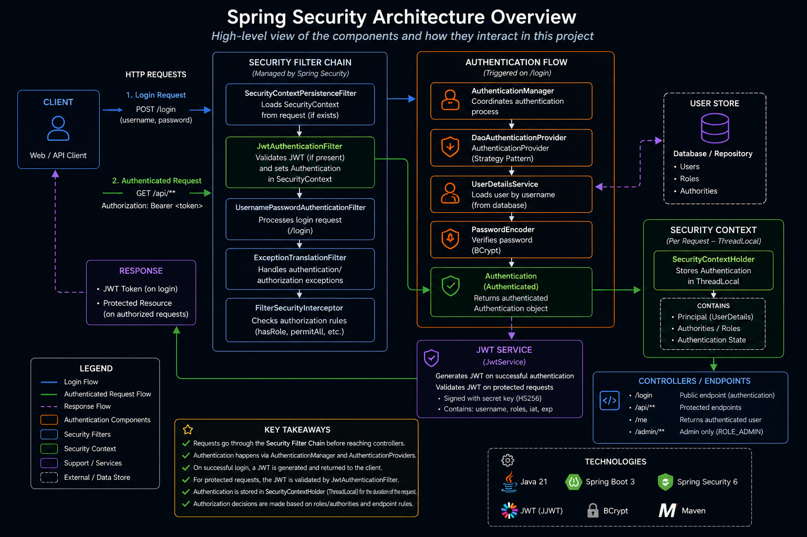
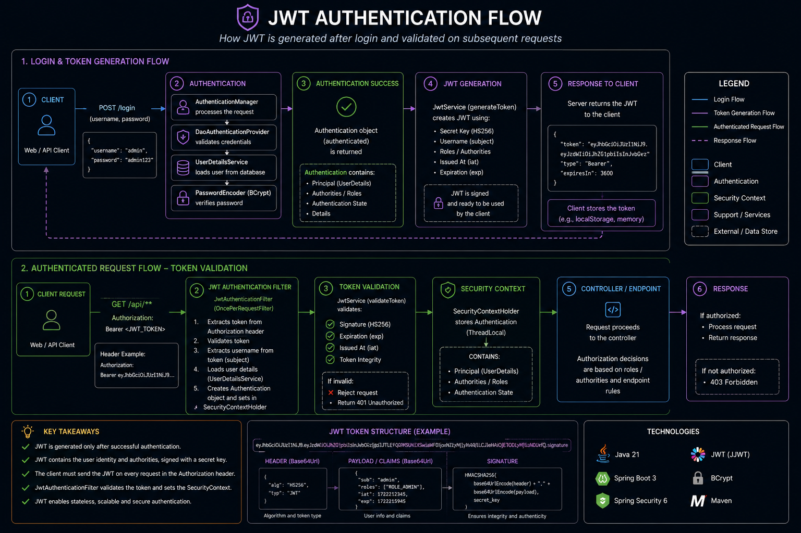
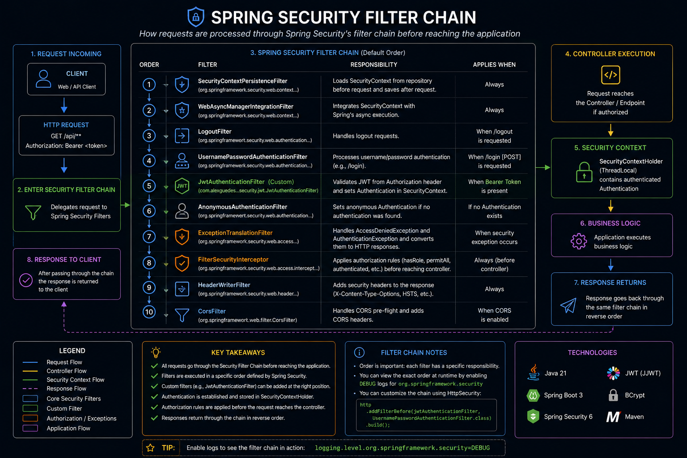

# Spring Security Architecture Study (JWT + Custom Authentication Flow)

This project is a hands-on study of Spring Security internals, focusing on how authentication and authorization work under the hood.
It demonstrates the evolution from default security configuration to a fully custom JWT-based authentication system.

## 🚀 Project Goals

* Understand Spring Security filter chain
* Implement custom authentication logic
* Replace default authentication with JWT
* Explore AuthenticationProvider strategy pattern
* Learn how SecurityContextHolder manages authenticated users
* Visualize the complete authentication flow using logs

---

## 📊 Architecture Overview

This diagram shows the complete Spring Security flow from request interception to authentication and authorization.

---

## 🔐 Authentication Flow

This diagram represents the login process using AuthenticationManager and DaoAuthenticationProvider.

---

## 🔑 JWT Authentication Flow

This diagram shows how JWT is generated after successful authentication and later validated by JwtAuthenticationFilter.

---

## 🛡 Security Filter Chain

Illustrates how Spring Security processes each request through its filter chain before reaching controllers.

---

## 🧠 What This Project Covers

### 1. Spring Security Basics
   * Default Spring Security configuration
   * Automatic authentication setup
   * Introduction to SecurityFilterChain

---

### 2. Custom Security Configuration
   * Manual SecurityFilterChain configuration
   * Endpoint authorization rules
   * Public vs protected routes
   * HTTP Basic authentication

---

### 3. Authentication Architecture
   * Custom UserDetailsService
   * In-memory authentication
   * Password encryption using BCryptPasswordEncoder

---

### 4. Authentication Providers

Understanding how AuthenticationProvider works internally.

Studied providers:

* DaoAuthenticationProvider
* JWT Authentication concepts

Current implementation relies on Spring's default DaoAuthenticationProvider.

---

### 5. Security Context Understanding
   * How Spring stores authenticated users
   * SecurityContextHolder usage
   * ThreadLocal-based request authentication
   * /me endpoint to expose current user

---

### 6. JWT Authentication (Stateless Security)
   * JWT token generation and validation
   * JwtService implementation
   * JwtAuthenticationFilter using OncePerRequestFilter
   * Stateless authentication replacing HTTP sessions
   * Bearer token-based requests

---

### 7. Security Flow Logging (Observability)
   * Added logs to trace authentication pipeline
   * Visual understanding of Spring Security execution flow:

Request
↓
SecurityFilterChain
↓
AuthenticationManager
↓
DaoAuthenticationProvider
↓
UserDetailsService
↓
PasswordEncoder
↓
Authentication Success
↓
JWT Generation
↓
Response

---

## 🔐 JWT Authentication Flow (Stateless Security)

POST /login
↓
UsernamePasswordAuthenticationToken
↓
AuthenticationManager
↓
DaoAuthenticationProvider
↓
UserDetailsService
↓
PasswordEncoder
↓
Authentication (authenticated)
↓
JWT Generation (JwtService)
↓
Response
↓
Client receives token

Request /api/**
↓
Authorization: Bearer <token>
↓
JwtAuthenticationFilter
↓
SecurityContextHolder
↓
Controller

---

## Internal Components Explored

* SecurityFilterChain
* UsernamePasswordAuthenticationToken
* AuthenticationManager
* AuthenticationProvider
* DaoAuthenticationProvider
* UserDetailsService
* PasswordEncoder
* SecurityContextHolder
* OncePerRequestFilter
* JWT Authentication Flow

## Tecnologias

* Java 21
* Spring Boot 3
* Spring Security 6
* Maven
* JUnit 5
* MockMvc
* JWT (Custom implementation using OncePerRequestFilter)

---

## 📌 Concepts Demonstrated

### Security Filter Chain

Responsible for intercepting all HTTP requests and applying configured security filters.

### AuthenticationManager

Coordinates the authentication process by delegating to a compatible AuthenticationProvider.

### AuthenticationProvider

Performs authentication logic by validating credentials and returning a fully authenticated Authentication object if successful.

Examples:

* Username and password
* JWT tokens
* OAuth2
* API Keys

### UserDetailsService

Responsible for loading user data.

Examples:

* Database
* LDAP
* External API

---

## Design Patterns Identified

### Strategy Pattern
AuthenticationProvider

### Chain of Responsibility
SecurityFilterChain

### Template Method
OncePerRequestFilter

### Factory Pattern
AuthenticationManager creation

### Dependency Injection
Spring IoC Container

---

## ⚙️ Project Features

* Login with username and password
* JWT authentication
* Protected endpoints
* Roles and authorities
* Integration tests
* Logs demonstrating each step of the security flow
* Explanatory diagrams

---

## 🧠 Key Learnings

* Spring Security is based on a filter chain architecture
* Authentication is handled via AuthenticationManager + Providers
* AuthenticationProvider follows the Strategy Pattern
* SecurityContextHolder stores authentication per request (ThreadLocal)
* JWT enables stateless authentication
* Filters are the core mechanism behind request security

---

## 🎯 Purpose of this project

This project intentionally avoids production complexity and focuses on understanding Spring Security internals, filter execution order, and authentication delegation flow.

It is not intended as a production-ready architecture, but as an educational exploration of Spring Security internals.

---

## 🧪 Learning Outcome

This project helped me understand how Spring Security delegates authentication through multiple layers instead of handling it directly, making the framework highly extensible and flexible.

---

## 👨‍💻 Author

Alex Guedes

Study project focused on mastering Spring Security architecture and JWT-based authentication flows.

📌 LinkedIn: https://www.linkedin.com/in/alex-guedes-silva/